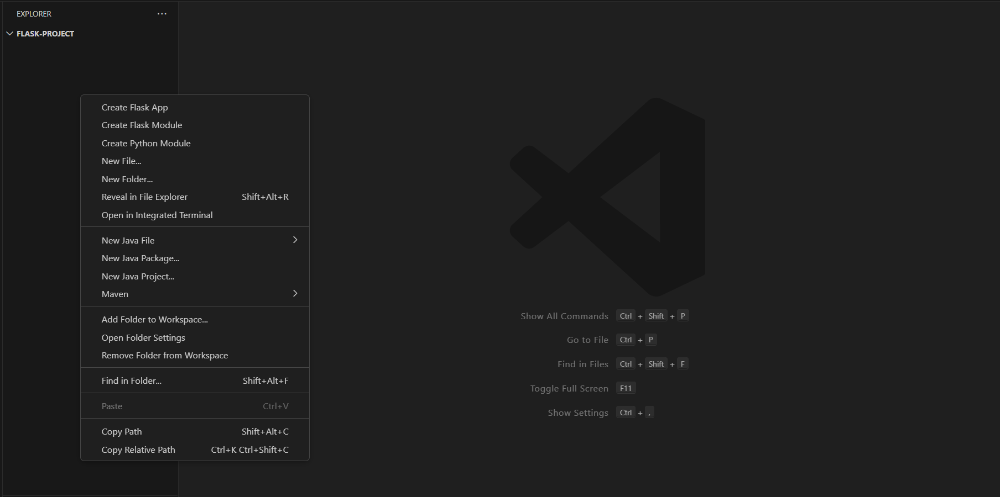
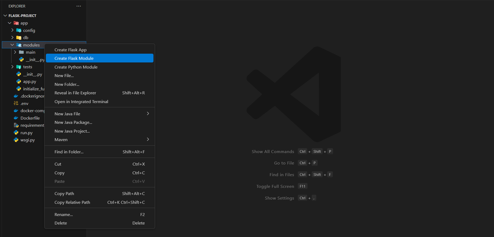
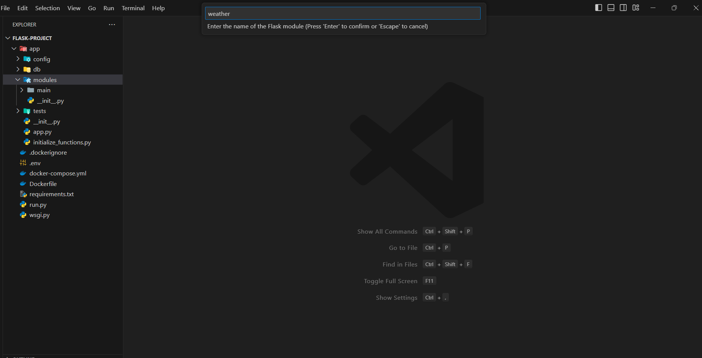
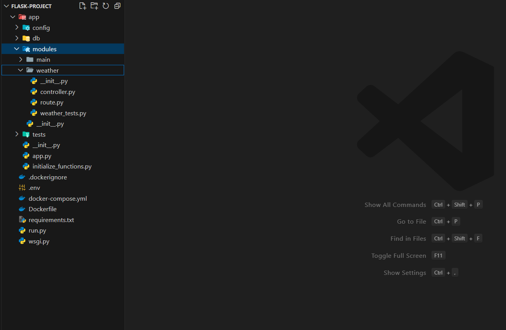

# Flask Builder

Flask Builder is a Visual Studio Code extension designed to quickly scaffold a Flask application with the necessary modules, Docker support, and OOP-style tests. 


## Screenshots
<div style="display: flex; flex-wrap: wrap; gap: 10px;">
	 
	
	
	
</div>

## Features

- **Flask App Structure**: Automatically creates a Flask application structure with `config`, `db`, `modules`, and `tests` directories.
- **Main Module**: Includes a `main` module inside the `modules` directory with a sample route, controller, and OOP-style tests.
- **Docker Support**: Generates a `Dockerfile` and `docker-compose.yml` for easy Docker setup.
- **.env File**: Adds a default `.env` file for environment variables.
- **Testing**: Includes Pytest configuration and example tests.

## Usage

1. **Create Flask App**:
   - Right-click on a folder in the Explorer view.
   - Select `Create Flask App`.

## Example

The generated structure includes:
```
app/
├── config/
│   ├── __init__.py
│   └── config.py
├── db/
│   ├── __init__.py
│   └── db.py
├── modules/
│   └── main/
│       ├── __init__.py
│       ├── routes.py
│       ├── controller.py
│       └── tests_main.py
├── tests/
│   ├── __init__.py
│   └── conftest.py
├── app.py
├── initialize_functions.py
├── run.py
└── wsgi.py
Dockerfile
docker-compose.yml
.env
requirements.txt
```


## Requirements

- Visual Studio Code v1.91.0 or higher

## Installation

1. Download and install the extension from the VSCode Marketplace.
2. Reload VSCode.

## Release Notes

### 1.1.3

- Added option to add module

---

## Support the Project

If you find this extension useful, consider supporting its development by [buying me a coffee](https://buymeacoffee.com/rabinhansda).

**Enjoy using Flask Builder! If you have any issues or suggestions, please open an issue on the [GitHub repository](https://github.com/rabinhansda24/flask-builder).**
